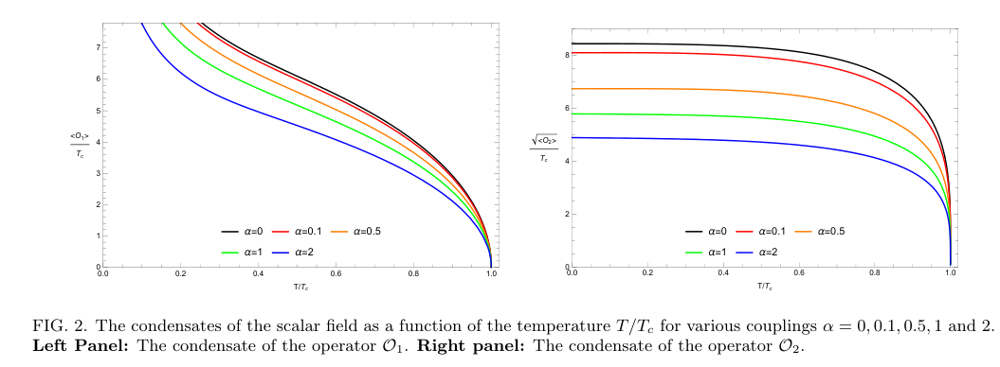
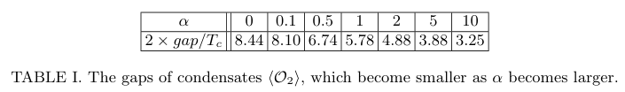
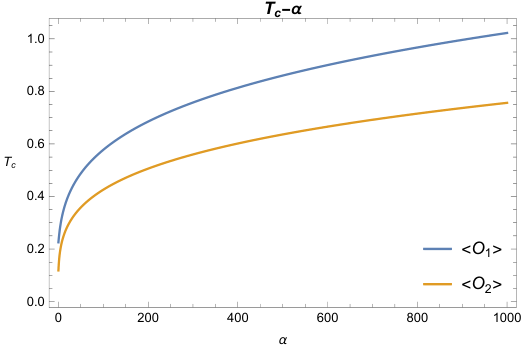
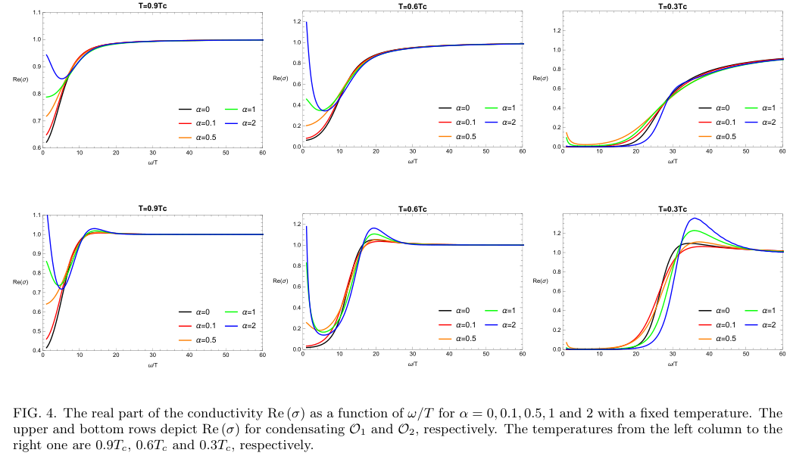
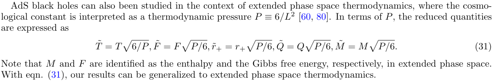
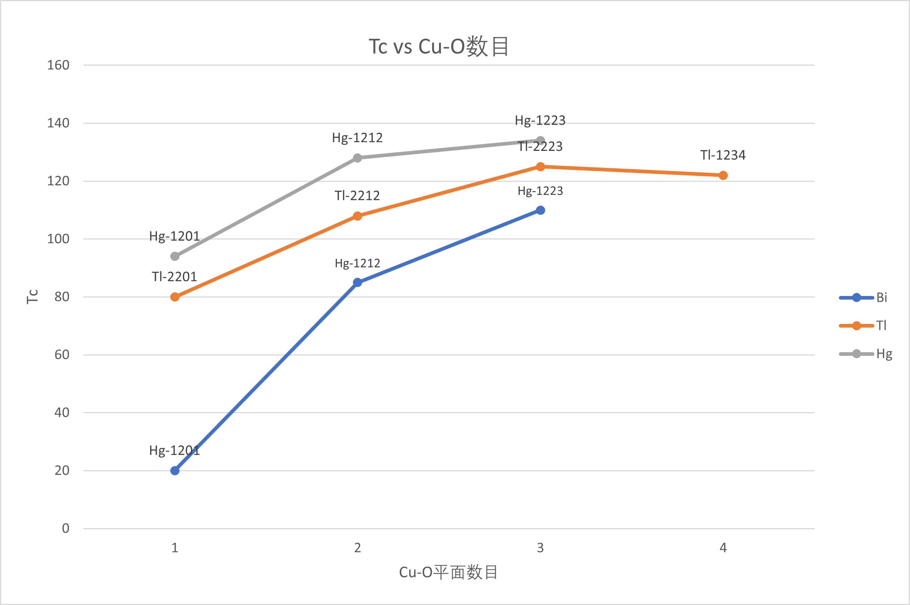
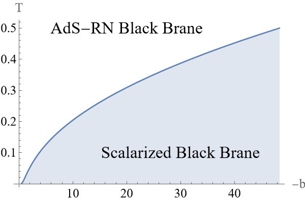
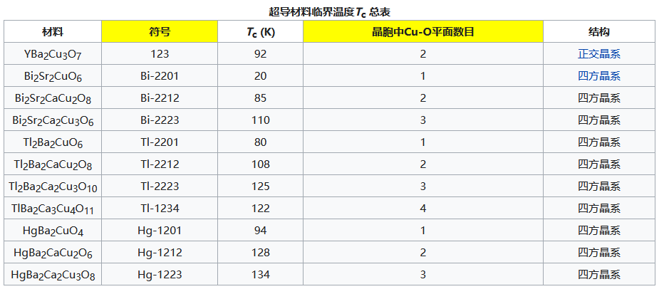

[文章：Holographic Superconductors in a Non-minimally Coupled Einstein-Maxwell-scalar
Model](https://arxiv.org/abs/2111.03810v2)

## 方程的推导

(基本和老师那篇差不了太多)

$\displaystyle S_{bulk}=\frac{1}{16\pi \tilde{G}N}\int \mathrm{d}^{4}x\sqrt{-g}\big[R+\frac{6}{L^{2}}-|\nabla \Psi-iqA \Psi |^{2}-m^{2}|\Psi |^{2}-\frac{h(\Psi )}{4} F_{\mu \nu }F^{\mu \nu }\big]$
$h(\Psi )\equiv e^{\alpha \Psi ^{2}}$

引入一个缩放 $A_{\mu }=\tilde{A}_{\mu }/q,\Psi =\tilde{\Psi}/q,\alpha =\tilde{\alpha}/q^{2}$ , 取极限 $q\to \infty$ 得到探针极限, 此时物质场对背景无影响，但电磁耦合作用依旧存在，简单起见考虑了在这个极限下，标量场和电磁场的行为

取施瓦西解

$$
ds^{2}=-f(r)dt^{2}+\frac{1}{f(r)}dr^{2}+r^{2}(dx^{2}+dy^{2})\\
f(r)\equiv (\frac{r}{L})^{2}-\frac{M}{r}
$$

物质场的运动方程

$$
\nabla _{\mu }\nabla ^{\mu }\Psi -(A_{\mu }A^{\mu }+m^{2})\Psi -\frac{\alpha}{4}e^{\alpha \Psi ^{2}}F^{2}=0\\
2\Psi ^{2}A_{\mu }-\nabla ^{\nu }(e^{\alpha \Psi ^{2}}F_{\nu \mu })=0
$$

取球对称

$$
\Psi =\Psi (r),\quad A_{\mu }dt=\phi (r)dt
$$

运动方程变为：

$$
\Psi ''+(\frac{f'}{f}+\frac{2}{r})\Psi '+\frac{q^{2}\phi ^{2}}{f^{2}}\Psi +\frac{m^{2}}{f}\Psi +\frac{\alpha \phi '^{2}}{2f}e^{\alpha \Psi ^{2}}\Psi =0\qquad (6)\\
\phi ''+(2\alpha \Psi \Psi '+\frac{2}{r})\phi '-\frac{2q^{2}\Psi ^{2}e^{-\alpha \Psi ^{2}}}{f}\phi =0\qquad (6)
$$

边界处渐进形式,取 $\displaystyle \Delta _{\plusmn}=\frac{3\plusmn\sqrt{9+4m^{2}L^{2}}}{2}$,$\displaystyle m^{2}=-\frac{2}{L^{2}}$

$$
\Psi =\frac{\Psi ^{(1)}}{r^{1}}+\frac{\Psi ^{(2)}}{r^{2}}+ \cdots \\
\phi =\mu -\frac{\rho}{r}+ \cdots
$$

根据AdS、CFT对偶，有如下对应

$$
\langle \mathcal{O}_{i} \rangle =\sqrt{2}\Psi ^{(i)},
$$

## 电导

引入一个不知道从哪里来的一个$A_{x}$, 可以将运动方程(6)变成如下形式

$$
A_{x}''+(2\alpha \psi \psi '+\frac{f'}{f})A_x '+(\frac{\omega^{2}}{f^{2}}-\frac{2q^{2}\Psi ^{2}e^{-\alpha \Psi ^{2}}}{f})A_x =0
$$

在视界处引入入射波边界条件 $A_x\sim f^{-i\omega /3r_0}|_{r\to r_0}$ , 在边界处 $A_x$ 的渐进性为如下

$$
A_x=A^{(0)}_{x}+\frac{A^{(1)}_{x}}{r}+ \cdots
$$

According to the AdS/CFT dictionary, the dual source and expectation value for the electric field are given by

$$
E_x=i \omega A_x^{(0)},\quad \left< J_{x} \right> =A_x^{(1)}
$$

因此电导率，由欧姆定律给出

$$
\sigma (\omega )=- \frac{iA_{x}^{(1)}}{\omega A_x^{(0)}}
$$

## 数值结果

对我而言有点启发的结果

- 凝聚度 零温极限 $\lim_{t \to 0}\left<\mathcal{O}_{2} \right> =constant$ ，并把这个常数解释为两倍的superconducting gap ,BCS理论中 $2\times gap=3.5 T_c$ ,给了个这个值关于耦合常数 $\alpha $ 的表
  (wiki百科 $\Delta (T=0)=1.764k_{B}T_{c}$)
  
  

比较平庸的结果

- 相图，凝聚的临界温度随着耦合常数的上升而上升，耦合常数能促进凝聚的发生,临界指数=1
  
- 不同$\left<\mathcal{O}_i \right> $下电导率和频率的关系
  

$-b$ 一开始我感觉有可能是压强之类的外部环境的常数
但是王鹏的一篇[文章](https://arxiv.org/abs/2102.04015v2)末尾写道，宇宙学常数常用来解释为热力学压强

所以这个耦合常数可能是材料内部特性而不是外部可调参数
找了一下一些超导材料的临界温度与晶胞中Cu-O平面数目的表格和相图看起来有点像，所以我觉得，这个耦合常数 `b`应该可以解释为材料内部的一些结构的常数，就像是这个表里面的晶胞内Cu-O平面数目

|    |    |
| :------------------: | :----------------: |
|  |  |
